### 《杀戮尖塔2》模组开发教程02 - 自定义遗物
杀戮尖塔2的 所有遗物，卡牌，牌组，角色，能力，Buff效果 等对象都统一继承于一个基类 AbstractModel ，这个类实现了大量的事件钩子回调函数，这些回调函数会由内部的事件钩子系统调用（Hook），我们只需要重写函数，就可以监听函数对应事件。

所有 AbstractModel 都必须注册到 ModelDb 中，注册的过程中，会为每个注册对象生成模块ID（ModelId类），用于冲突校验，本地化等功能。

创建遗物脚本逻辑
杀戮尖塔2的所有遗物统一继承于 RelicModel 这个抽象类。

接下来直接粘贴一段基础遗物的代码，创建一个类，名为 MyCustomRelic，继承于 RelicModel 抽象类。

注意，遗物的类名必须唯一，否则可能会造成冲突。游戏本体在注册遗物时会根据类名构造遗物的ID，将大驼峰类名转成 大写字符加下划线分割的形式，

我们想要的效果是，当持有者第一回合开始时，给予持有者角色一点能量。
using MegaCrit.Sts2.Core.Combat;
using MegaCrit.Sts2.Core.Commands;
using MegaCrit.Sts2.Core.Entities.Relics;
using MegaCrit.Sts2.Core.Localization.DynamicVars;
using MegaCrit.Sts2.Core.Models;
using System.Collections.Generic;
using System.Threading.Tasks;

namespace MyCustomMod
{
    public class MyCustomRelic : RelicModel
    {
        public override RelicRarity Rarity => RelicRarity.Starter;
        // 稀有度

        protected override IEnumerable<DynamicVar> CanonicalVars => [
            new EnergyVar(2) // 关联 能量 的动态变量
            ];
        // 动态变量
        public override async Task AfterSideTurnStart(CombatSide side, CombatState combatState)
        {
            // 判断事件调用时是否为遗物持有者一方，且回合数是否为 1
            if (side == Owner.Creature.Side && combatState.RoundNumber == 1)
            {
                Flash(); // 触发遗物图标闪烁
                await PlayerCmd.GainEnergy(DynamicVars.Energy.BaseValue, Owner);
                // 给予玩家能量
            }
        }
    }
}

接下来我们主要讲解代码逻辑。

稀有度
Rarity 字段表示物品的稀有度，他有如下取值：
public enum RelicRarity
{
    None,
    Starter, // 初始遗物
    Common, // 普通遗物
    Uncommon, // 罕见遗物
    Rare, // 稀有遗物
    Shop, // 商店遗物
    Event, // 事件遗物
    Ancient // 先古之民给予的遗物
}
稀有度会影响一件遗物的获取方式，Starter/Event/Ancient 类型的遗物不会在游戏的常规遗物抽取流程（宝箱/精英）获取，而是在游戏开始/事件获取，此外，这类遗物也是不可交易的，物交换类事件不会选择这种类型的遗物。

而 Common/Uncommon/Rare 类型的遗物会出现在宝箱，精英战斗结束后，也就是常规的遗物。

Shop 稀有度基本是商店专用，同样不会在宝箱或者精英获取到，只有可能在商人的商店中刷新。

动态变量
动态变量是杀戮尖塔2的属性展示模块，例如，第一回合开始后给予玩家1点能量，其中的“1”是需要特殊标记为能量的部分，当动态变量中的数值发生改变，显示部分也会同时改变，保证了代码和描述同步。

此外，不同的类型格式，比如能量/金币等显示的UI，格式，颜色都不一定相同，使用对应的动态变量可以确保UI正常显示。

CanonicalVars 是一个DynamicVar类型的迭代器对象（IEnumerable<DynamicVar>）我们可以分配一个数组或者列表给它。

我们可以通过遗物自身的 DynamicVars.<动态变量集合中对应的字段名称>.BaseValue 获取 CanonicalVars 中的值，也可以动态修改它。

关于字段名称都有哪些，各位可以查看 res://src/Core/Localization/DynamicVars/DynamicVarSet.cs 这个类脚本。

回合开始事件钩子函数
AbstractModel 中的 AfterSideTurnStart 是一个异步函数，这个钩子函数当某一方回合开始时触发，相对的，BeforeSideTurnStart 表示在某方回合结束时触发：
public async Task AfterSideTurnStart(CombatSide side, CombatState combatState)
其中，第一个参数表示当前是由哪一方的回合开始了，它的取值如下：

public enum CombatSide
{
    None, // 无
    Player, // 玩家
    Enemy // 敌人
}
我们判断 side 参数值是否等同于 Owner.Creature.Side （持有者方）即可。

combatState 参数表示战斗状态上下文，用于访问当前战斗的全局状态，例如：回合数，当前处于哪方行动，玩家列表，敌人列表等。

遗物的 Flash 方法

Flash 方法比较容易理解，当遗物生效时，让玩家这边的遗物图标闪烁一下，提示玩家这个遗物生效了。
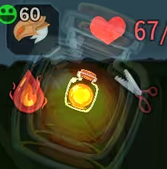
PlayerCmd 接口
PlayerCmd 是一个全局接口，负责对玩家端的操作。例如，增加/减少/设置能量，增加/减少/设置金钱，增加/减少/设置辉星（储君），添加宠物（亡灵契约师），结束回合等等...

同时，相关方法都是异步方法，关联战斗管理器中有关动画的部分。

目前示例代码中的这句代码：

await PlayerCmd.GainEnergy(DynamicVars.Energy.BaseValue, Owner);
表示给遗物的持有者（Owner）添加 'DynamicVars.Energy.BaseValue' 点能量，这个就是上面提到的动态变量，同时，等待动画结束。

添加遗物到遗物池
在初始化函数中，调用 ModHelper 接口的 AddModelToPool 方法，将我们自定义的遗物类注册到对应的遗物池。

遗物池影响这个遗物的获取方式：

角色池：IroncladRelicPool、SilentRelicPool、DefectRelicPool、NecrobinderRelicPool、RegentRelicPool。放“这个角色专属”的遗物。它们会并入玩家自己的随机遗物袋，用于精英奖励和商店。

SharedRelicPool：公共遗物池。既会进玩家的随机遗物袋，也会单独进宝箱用的共享遗物袋，所以它影响精英、商店、宝箱三类来源。

EventRelicPool：事件遗物分类池。处于这个池中的遗物不会被常规手段获取，只能通过问号事件获取。

FallbackRelicPool：兜底池，基本只有Circlet（头环）在这个池中，当正常抽取失败时用。

DeprecatedRelicPool：废弃内容/兼容存档用，不参与正常获取。参考 DeprecatedRelicPool.cs。
[ModInitializer(nameof(Initialize))]
public static class MyCustomModInitializer
{
    public static void Initialize()
    {
        try
        {
            ModHelper.AddModelToPool(typeof(IroncladRelicPool), typeof(MyCustomRelic));

            var harmony = new Harmony("Yanxiyimeng.MyCustomMod");
            harmony.PatchAll();
            // 初始化 harmony 库
        }
        catch(Exception e)
        {
            Log.Error("MyCustomMod - 加载失败");
            Log.Error(e.Message);
            return;
        }
        Log.Info("MyCustomMod - 加载成功!");
    }
}
通过 ModHelper.AddModelToPool 我们将这件自定义遗物注册到 铁血战士 的遗物池，不过虽然我们将这件自定义遗物注册到对应的遗物池，但由于这件遗物的稀有度是"Starter"，因此仍旧不会在商店/精英刷新，我们后面需要手动为其添加获取方式。

我们这里额外添加了一段安全性校验，在初始化过程中出现错误，则输出“MyCustomMod - 加载失败”错误提示，并。打印错误

我们使用 <作者名称>.<模组ID> 的方式初始化一个 Harmony 对象，随后调用它的 PatchAll 方法，将所有补丁打进游戏。

修改角色的初始遗物列表
角色的初始遗物通过对应角色类内部的 StartingRelics 属性获取，这个字段的类型是一个只读的集合列表。

我们通过 HarmonyLib 为 Ironclad 打补丁（Ironclad就是铁血战士类）修改它的 StartingRelics 的 Getter 访问器。

[HarmonyPatch(typeof(Ironclad), nameof(Ironclad.StartingRelics), MethodType.Getter)]
public static class IroncladStartingRelicsPatch
{
    static void Postfix(ref IReadOnlyList<RelicModel> __result)
    {
        var customRelic = ModelDb.Relic<MyCustomRelic>();
        // 从注册的数据库中获取我们自定义的遗物实例对象

        if (__result.Any(r => r.Id == customRelic.Id))
            return;
        // 遍历原本的初始遗物列表，如果已经存在这个遗物，就直接返回

        var list = __result.ToList();
        list.Add(customRelic);
        __result = list;
        // 向 __result 追加 customRelic自定义遗物对象
    }
}
原版铁血战士的遗物列表是一个固定的只读列表（IReadOnlyList<RelicModel>），其中只存在一个元素 BurningBlood（燃烧之血）。

当 StartingRelics 被 Getter 访问，一般说明游戏本体要读取 铁血战士 的遗物池，我们就可以篡改遗物池，向遗物池中追加一件我们自定义的遗物实例。

为遗物添加本地化信息
每件遗物对象都需要本地化信息，否则可能游戏会抛出异常，遗物的本地化信息一般在对应模组的 res://<你的模组ID>/localization/<语言代号>/relics.json 下存储。

语言代号的文件夹如下列所示：

localization/
  eng/          # English (source)
  deu/          # German
  esp/          # Spanish
  ita/          # Italian
  jpn/          # Japanese
  kor/          # Korean
  pol/          # Polish
  ptb/          # Portuguese (Brazil)
  rus/          # Russian
  tha/          # Thai
  tur/          # Turkish
  zhs/          # Chinese (Simplified)
因此，我们将本地化文件放置在 res://MyCustomMod/localization/zhs/relics.json 这个路径即可，我们目前不考虑其他语言。
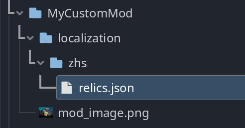
遗物的本地化JSON格式
本地化JSON要求必须遵守固定的格式：

按照 <遗物ID>.title/description/flavor 区分不同翻译的字段文本。

遗物的ID在前面提到过，是通过遗物类名构造的，所以这里的 MyCustomRelic 类的 ID 就是 MY_CUSTOM_RELIC。

{
  "MY_CUSTOM_RELIC.title": "瓶装能量",
  "MY_CUSTOM_RELIC.description": "每场战斗开始时，获得 {Energy} 点能量。",
  "MY_CUSTOM_RELIC.flavor": "这个瓶子中蕴含着无尽的力量"
}
title 表示这件遗物显示的名称，description 表示这件遗物的功能描述信息，flavor一般出现在游戏的百科大全中，表示一小段文本引言。

遗物的图标
游戏遗物的“大图标”存在于路径 images/relics/<遗物精灵纹理>.png，至于为什么叫做“大图标”会在后面解释。图标图像大小推荐是 256*256 像素格式。

基础的遗物图像以你的遗物ID小写命名，例如遗物ID是 MY_CUSTOM_RELIC ，那么你的遗物图像应该使用 my_custom_relic.png 命名。

另外，当玩家还没发现过这件遗物时，会显示描边图像，描边图像的命名规则不固定，UP主推荐将描边图像设置为 <遗物图像名称>_outline 也就是 my_custom_relic_outline.png
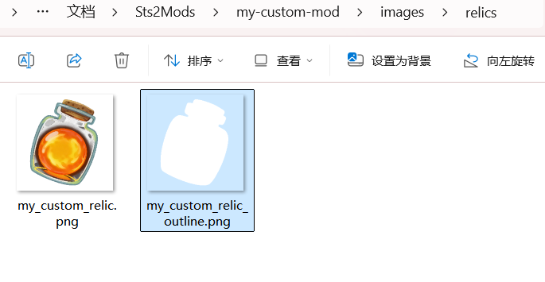
首先将这两个图像命名为合适的名称，随后放到对应的路径。

创建遗物图标资源
我们需要创建两个文件夹，用于指定运行时的遗物图标的资源，如果我们添加了超多遗物，那么我们最好是将所有遗物打包为一张大的纹理页，然后使用Godot 的 裁切纹理（AtlasTexture）指定一个子区域作为当前遗物的图标。

游戏本体会在下面的路径寻找对应的纹理资源：

遗物图标目录：res://images/atlases/relic_atlas.sprites/

遗物描边图标目录：res://images/atlases/relic_outline_atlas.sprites/

大图标目录：res://images/relics/

若无法在 遗物图标目录/遗物描边图标目录 找到对应的资源，就会尝试用大图标替换遗物的纹理，因此，要显示合适的纹理，就必须创建图标资源。

我们根据上面的路径，创建对应的文件结构，然后右键文件夹，找到 新建 > 资源。

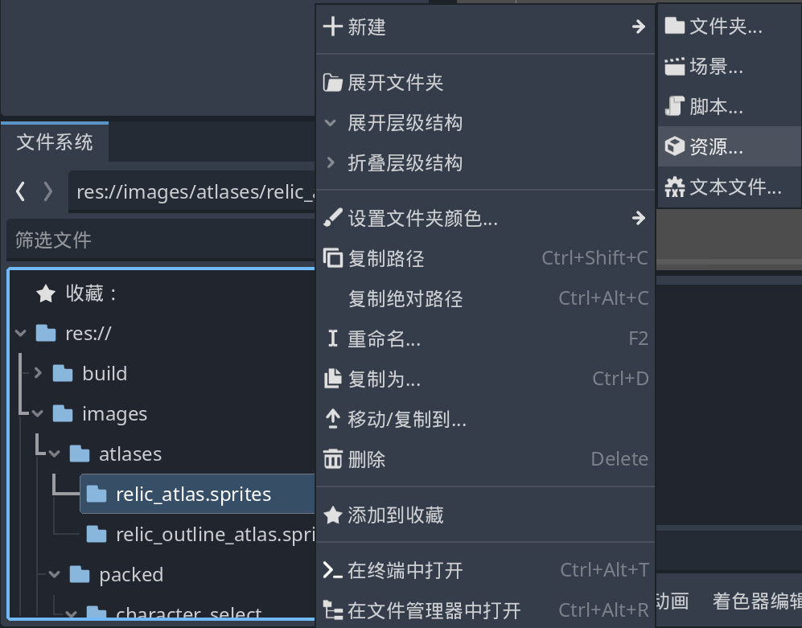
点击资源后，会弹出 创建Resource 窗口，我们在上方的搜索框中搜索AtlasTexture ，然后点击创建资源。
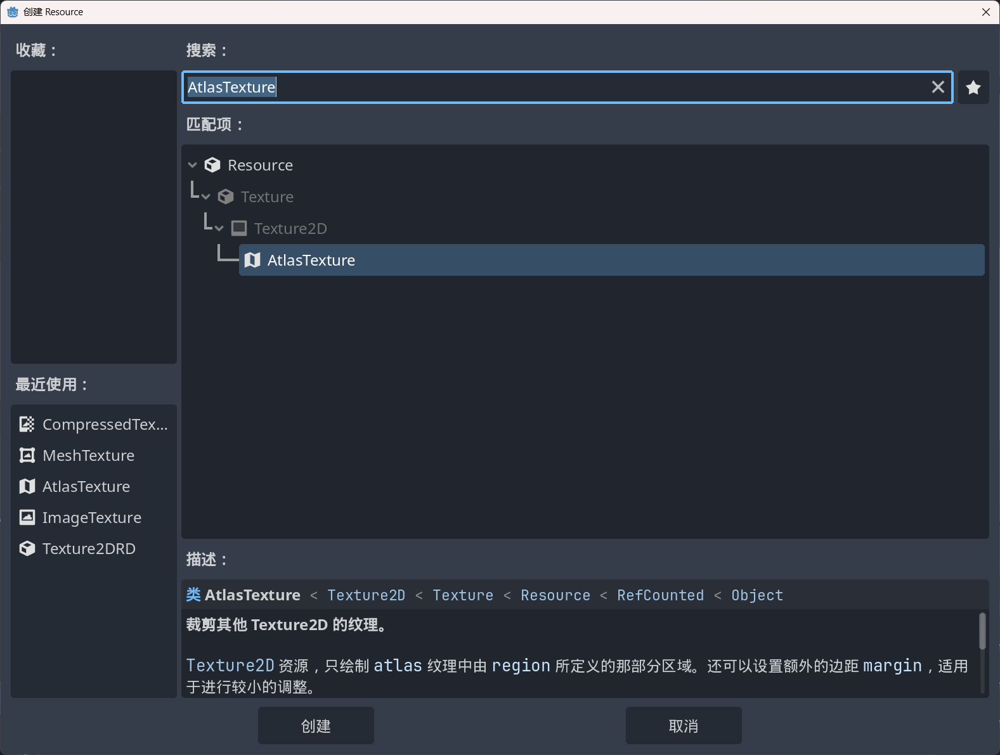
将新资源的名称命名为带下划线的小写的遗物ID名 <小写遗物ID>.tres。
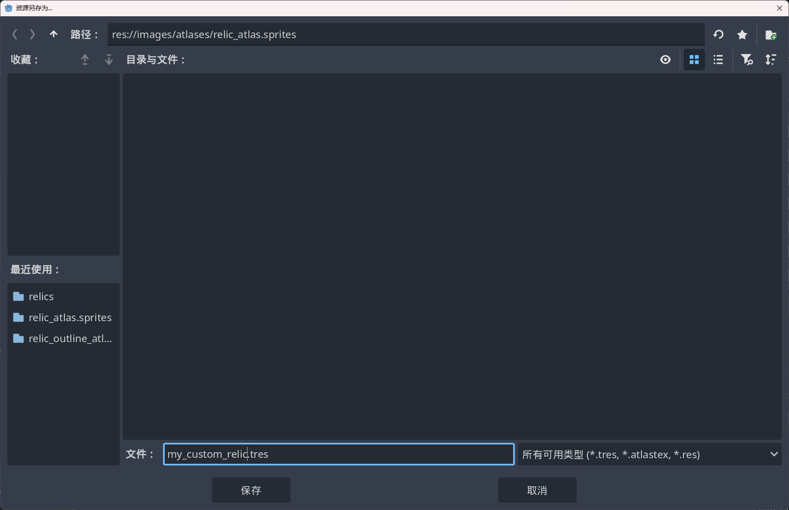
创建好资源后，我们双击这个新建的资源，这时，右侧的属性检查器就会显示新资源的内容。
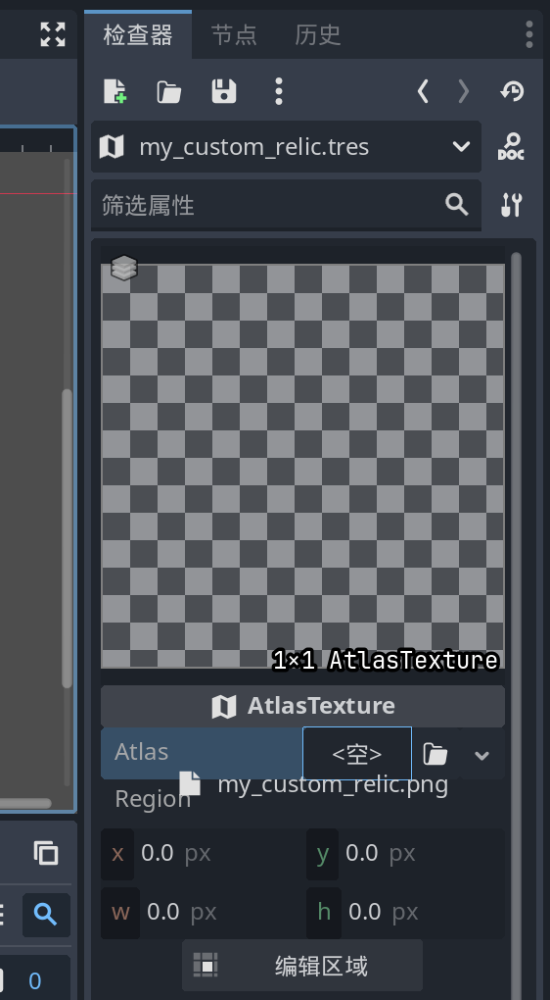
要想指定资源的纹理，我们就直接将对应的PNG图像拖拽到 属性检查器的 Atlas 中即可，随后，编辑Region属性，将 Region 属性的 w 与 h值调整为遗物图标资源的大小，这里就是 256 * 256。

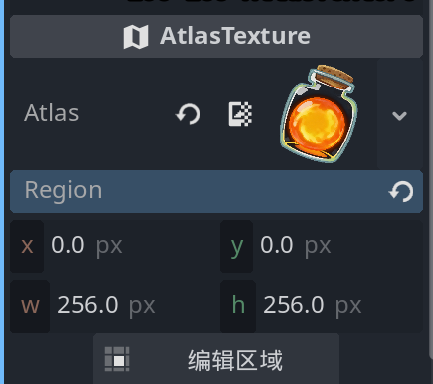
对于描边纹理资源，步骤也是一样的，只不过要创建在 relic_outline_atlas.sprites 目录，资源的名称也一样是 <小写遗物ID>.tres

描边纹理资源与遗物纹理的大小必须一致，否则显示的时候会出现一些问题。

运行模组
将模组的PCK/DLL/JSON全部准备好，放到Godot/Megadot编辑器的 mods 目录下，运行STS2项目。

错误解决
若你在编辑器中运行项目加载模组后出现
System.PlatformNotSupportedException: CoreCLR version 10.0.4 is not supported at HarmonyLib...
一般是 Godot4.5.1 的 .NET 版本太高导致的，HarmonyLib 若使用 9.0版本，那么游戏编辑器宿主的 .NET 版本也一定要是 9.0版本。

我们在编辑器目录找到GodotSharp\Api\Debug\GodotPlugins.runtimeconfig.json 这个配置文件，将其修改为以下内容，强制编辑器在运行项目时使用 .NET9.0 框架。

{
  "runtimeOptions": {
    "tfm": "net9.0",
    "rollForward": "LatestPatch",
    "framework": {
      "name": "Microsoft.NETCore.App",
      "version": "9.0.0"
    }
  }
}
测试模组遗物
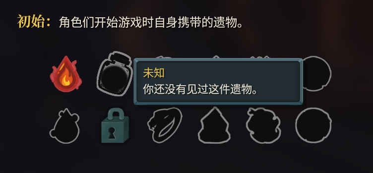
在游戏的百科大全中，可以看到若没有获取到遗物，会显示描边纹理+黑色的遗物资源纹理。
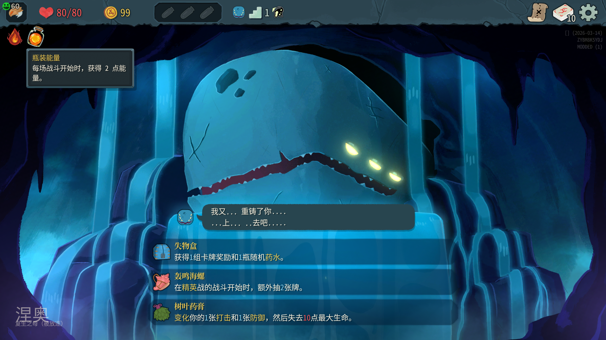
运行游戏，由于我们修改了铁血战士的初始遗物列表，游戏会在战斗开始后自动为铁血战士这个角色添加一份遗物。
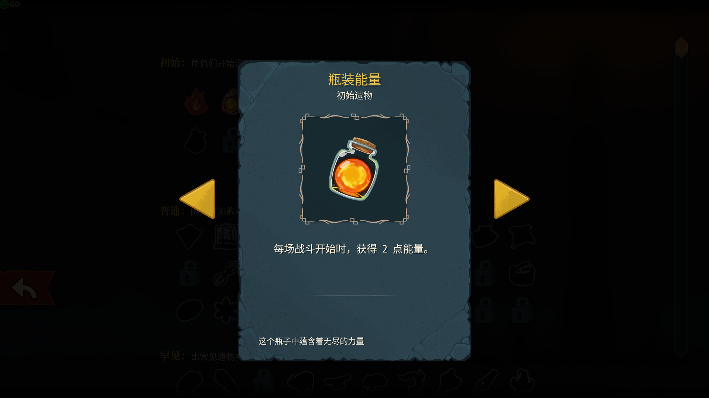
在百科大全中，会显示详细的遗物信息，并显示遗物的大图。